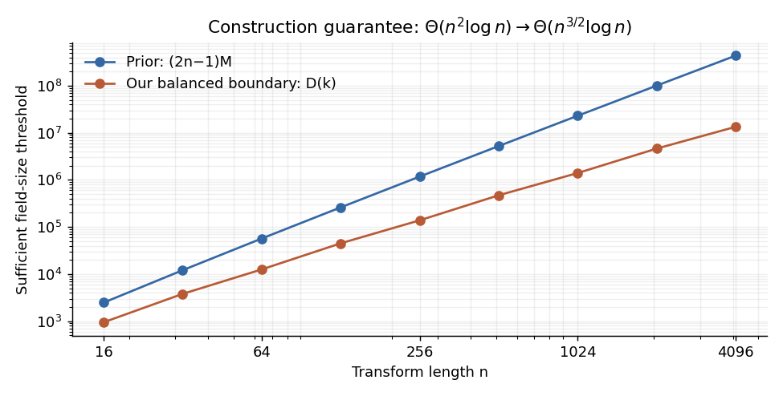
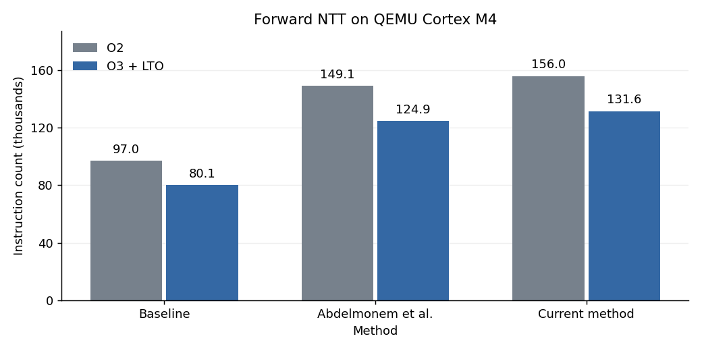
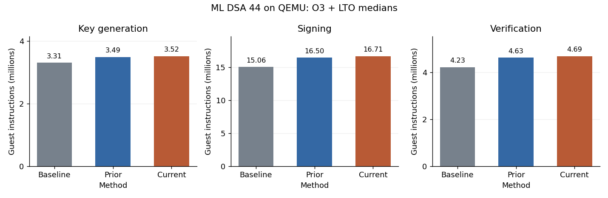

# Algebraic fault detection for the ML-DSA NTT

This is my honors thesis for my Bachelor's degree. It makes an improvement on algebraic fault detection for the Number Theoretic Transform (NTT), a linear transform used to accelerate polynomial multiplication in lattice based post quantum schemes such as ML-DSA and ML-KEM. A corrupted intermediate value can produce an incorrect transformed polynomial and can lead to key recovery when done many times intentionally. The goal of my thesis is to detect every nonzero output error caused by at most two additive faults at the modeled NTT wires.

I independently implemented ML-DSA-44 from [NIST FIPS 204, Module Lattice Based Digital Signature Standard](https://csrc.nist.gov/pubs/fips/204/final), including keygen, signing, verification, polynomial arithmetic and SHAKE. I then implemented the two fault detection construction of [Abdelmonem et al.](https://eprint.iacr.org/2025/170) and my improved deterministic construction inside the same implementation. My construction reduces the finite field size needed for fault deteection by a factor of $\Theta(\sqrt n)$. The present C implemenation uses more field multiplications than Abdelmonem et al, however it offers more robust fault detection as well.

The code in this repository builds ML-DSA and the fault detections schemes in portable C and for ARM Cortex-M4. The recorded benchmarks count ARM instructions on QEMU's `mps2-an386` Cortex M4 model for both schemes to find the overhead for each. Reference firmware targets are `NUCLEO-F411RE` with `STM32F411RE` and `NUCLEO-F446RE` with `STM32F446RE`. Baseline, Abdelmonem et al. and the current method use the same cryptographic code, with different forward NTT wrappers. 

Validation includes official NIST vectors, malformed input tests, and CBMC proofs (which is ongoing). Test vectors can be found here (https://csrc.nist.gov/projects/post-quantum-cryptography/pqc-archive)

<p align="center">
  
  <br>
  <em>Chip on which I am benchmarking</em>
</p>


**NOTE**: The scheme essentially involves using Vandermode's identity to reduce the Abdelmonem et al brute force-ish construction to one that finds checksum vectors more efficiently. **This is still being written up for IACR publication, so do not use without prior permission.**

## NTT fault analysis

ML-DSA uses polynomial multiplication over the ring `Z_q[X]/(X^n+1)`, with `n=256` and `q=8380417`. Its NTT computes `y=T*p` over the finite field `F_q`, after which polynomial multiplication consists of coefficient products. Each butterfly adds, subtracts and multiplies by a fixed twiddle value, so the complete network is linear. A fault at an internal wire can affect several output coefficients.

Prasanna Ravi, Bolin Yang, Shivam Bhasin, Fan Zhang and Anupam Chattopadhyay demonstrated attacks involving NTT twiddle corruption in [Fiddling the Twiddle Constants: Fault Injection Analysis of the Number Theoretic Transform](https://eprint.iacr.org/2022/824). Such physical faults can affect many wires. The algebraic model used here concerns additive deviations at data wires, with trusted twiddles, checker arithmetic and control flow.

For a transform of length `n=2^h`, every array slot at each of the `h+1` layer boundaries is a modeled location. There are `M=n(h+1)` locations. A unit deviation at location `r` propagates to output vector `v_r`; a fault of magnitude `delta` adds `delta*v_r` to the output. The protection covers the forward NTT. Inverse transforms, SHAKE and faults in the checker are outside this model.

## Algebraic checks

Write the correct transform as `y=T*p`. An output checksum row `a` and input row `b` satisfy

$$
b=T^{\mathsf T}a,
\qquad b^{\mathsf T}p=a^{\mathsf T}y \pmod q.
$$

The checker computes `b^T*p`, runs the NTT once and computes `a^T*y`. Unequal values reject the result. Only the checksum sums are added to the transform computation.

### Single fault

The response to one deviation is

$$
A_r=a^{\mathsf T}v_r,
\qquad d_r=\delta A_r \pmod q.
$$

A nonzero fault is detected whenever `A_r` is nonzero at every modeled location. Sven Bauer, Fabrizio De Santis, Kristjane Koleci and Anita Aghaie developed a single fault defense using polynomial evaluation and interpolation in [A Fault Resistant NTT by Polynomial Evaluation and Interpolation](https://eprint.iacr.org/2024/788).

Mohamed Abdelmonem, Lukas Holzbaur, Håvard Raddum and Alexander Zeh generalized the checksum conditions in [Efficient Error Detection Methods for the Number Theoretic Transforms in Lattice Based Algorithms](https://eprint.iacr.org/2025/170). Their paper gives single fault checks for ML-KEM, ML-DSA and Falcon, and a two fault construction for ML-DSA. Interestingly, their approach does not work for ML-KEM as the size of the finite field required by their scheme is much larger than the field uses by ML-KEM. Our approach aims to remedy that with construction of a more field size efficient scheme.

### Two faults

One equality can miss two faults when their checksum responses cancel. Add a second row `alpha`, with input row `beta=T^T*alpha`, and define `B_r=alpha^T*v_r`. Every distinct pair must satisfy

$$
\Delta_{rs}=A_rB_s-A_sB_r\ne0 \pmod q.
$$

The two response columns are then independent, so two nonzero magnitudes cannot cancel both checks. Since every `A_r` is nonzero, the equivalent condition is that every ratio `B_r/A_r` is distinct. Abdelmonem et al. give this criterion and a deterministic two check construction for Dilithium in the [same paper](https://eprint.iacr.org/2025/170).

Abdelmonem et al. assign output weights recursively while excluding values that make a pair determinant zero. Half of their second output weights are one, reducing the extra products to `2.5*n`. This implementation omits those multiplications and stores only the remaining weights. [Abdelmonem et al. implementation](docs/prior_checker.md).

The production wrapper compares these two equations modulo `q`:

$$
\sum_i p_i=\sum_i a_i y_i,
\qquad \sum_i\beta_i p_i=\sum_i\alpha_i y_i.
$$

## My construction

The variables `u_0,...,u_{n-1}` are checksum weights at intermediate boundary `k`. I propagate each unit fault to that boundary using forward layers for earlier faults and inverse layers for later faults. Dividing its checksum response by the first response gives a linear form `W_r(u)`. For each location pair, construct `H_rs(u)=W_r(u)-W_s(u)`.

1. Assign each nonzero difference form to its greatest nonzero coordinate.
2. Visit coordinates in increasing order. Each assigned form forbids one field value at its last coordinate.
3. Collect those values and choose the smallest value absent from the set.
4. Derive the final input and output rows. If needed, add a multiple of the first row to make every second response nonzero; pair determinants are preserved.

The generator uses sparse wire propagation, groups constraints by their last coordinate and updates partial response values as coordinates are chosen. The field search takes at most the number of forbidden values plus one membership checks. It does not enumerate all `q` values or use random search. Boundary `k` is used during coefficient generation; execution still has two input/output equalities around one NTT. Algorithm and complexity.

### Construction bound

Abdelmonem et al. require the sufficient field condition `q>(2*n-1)*M`, with threshold

$$
(2n-1)M=\Theta(n^2\log n).
$$

The intermediate support bound gives

$$
K(k)=2^{k+1}+2^{h-k+1}-3,
\qquad D(k)=K(k)M-\frac{K(k)(K(k)+1)}{2}.
$$

At the boundary `k=floor(h/2)`,

$$
K(k)=\Theta(\sqrt n),
\qquad D(k)=\Theta(n^{3/2}\log n).
$$

The sufficient threshold improves by a factor $\Theta(\sqrt n)$, which is a great construction guarantees.

<!-- construction-results:start -->

For `n=256`, `h=8` and `k=4`, the generator verifies `M=2304`, `K=61`, `D=138653` and `q=8380417>D`.

| Method | Sufficient threshold |
| --- | ---: |
| Abdelmonem et al. | 1,177,344 |
| Current method | 138,653 |

The sufficient threshold is **8.49 times smaller**. Both methods certify all **2,653,056** possible fault location pairs with zero determinant failures.


<!-- construction-results:end -->

## Reproduction and C verification

```sh
make baseline prior our
make qemu-benchmark
python3 tools/plot_benchmarks.py
```

The benchmark needs Python with Matplotlib, ARM GCC with Newlib and QEMU with TCG plugin support. Reproduction commands include generators, exact certificates, compiler and sanitizer runs, ARM builds and tool overrides. [Thesis tables](docs/thesis_results.md) are generated from raw repository data.

CBMC with Z3 will check the C arithmetic, butterflies,  memory bounds, and checksum accumulation under documented preconditions. For now, the test vectors are passing (https://csrc.nist.gov/projects/post-quantum-cryptography/pqc-archive).

## ARM Cortex M4 measurements and optimization

I use QEMU to count the ARM instructions required by both checksum constructions and measure their overhead over baseline ML-DSA. All variants use the same inputs and ARM GCC `10.3.1`, at `-O2` and `-O3 -flto`. Compiler optimization and link time optimization reduce instruction counts; the coefficient sum needs no multiplications, and Abdelmonem et al.'s unity weights also need none. Instruction counts are not Cortex M4 cycles.

<!-- benchmark-results:start -->

Median forward NTT instruction count, `101` samples per build:

| Build | Baseline | Abdelmonem et al. | Current method | Current vs Abdelmonem et al. |
| --- | ---: | ---: | ---: | ---: |
| `-O2` | 96,999 | 149,082 | 155,996 | +4.64% |
| `-O3 -flto` | 80,139 | 124,927 | 131,576 | +5.32% |

At `-O3 -flto`, my checker uses **15.65% fewer NTT instructions** than its `-O2` build and **5.32% more** than Abdelmonem et al, which is reasonable overhead for reducing your finite field size by around a factor of 8.



Full ML-DSA-44 overhead at `-O3 -flto`, relative to baseline median instruction count:

| Operation | Abdelmonem et al. | Current method |
| --- | ---: | ---: |
| Key generation | 5.41% | 6.22% |
| Signing | 9.57% | 10.99% |
| Verification | 9.64% | 11.06% |



Each protected NTT adds `640` field multiplications for Abdelmonem et al. and `768` for my checker. Both add `1024` field additions, which in and of itself is not a bad overhead count.

[Raw observations](bench/qemu_benchmark.json), [all statistics](docs/qemu_results.md) and [CSV](bench/qemu_benchmark.csv). Python generates these tables and graphs from the raw record.
<!-- benchmark-results:end -->

### GCC SMLALD patch

Interesting note: while optimizing ARM instruction count, I found an opportunity to combine two signed `16` bit products accumulated into a `64` bit value. My ongoing [GCC patch](docs/compiler/gcc-smlald.patch) replaces two `SMLALBB` instructions and two high half extractions with one `SMLALD`. In the Cortex M4 example, the arithmetic sequence decreases from `4` instructions to `1`, and the complete function from `7` to `4`.

This ML-DSA implementation uses `32` bit field coefficients. The benchmark toolchain does not include the patch, so the reported counts contain no improvement from it. Patch tests.
